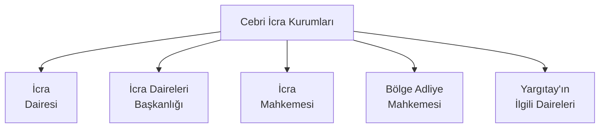

# İcra Hukuku - Genel Hükümler

İlk çağlarda borç ilişkisinden kaynaklı sorunlar şiddet ve tehdit içerikli olaylarla çözülebilirken günümüz modern hukuku bu tür sorunların önüne geçebilmek, toplumda oluşabilecek husumet ve kargaşayı önleyebilmek adına alacak davalarının medeni kurallar dahilinde sonuca bağlanmasını öngörmektedir. Örneğin; Roma Hukuku döneminde *manus iniectio* (el koyma) hükümleri gereği borçlu, borcunu ödemezse alacaklı onu zincire vurup köle olarak çalıştırabilirdi. Günümüzde alacak davası yüzünden borçluyu zincire vurup köle olarak çalıştırmak Türk Ceza Kanunu hükümlerince suç kabul edilmekte, buna rağmen alacaklının alacağını temin edebilmesi için de İcra ve İflas Kanunu'na başvurabileceği kanun koyucular tarafından belirtilmektedir.

## Bölümler
> [!Tip]
> En başa dönmek için klavyenizdeki Sol CTRL tuşu basılı iken Home tuşunu ya da bu sayfanın sağ üst köşesinde beliren "&#8593; Top" tuşunu kullanabilirsiniz.

&nbsp;[Cebri İcra](https://github.com/zinzinzibidi/icra-iflas-ve-konkordato-hukuku/blob/main/icra-hukuku-genel-h%C3%BCk%C3%BCmler.md#cebri-i%CC%87cra)

&nbsp;[İcra ve İflas Hukukunun Dayanağı](https://github.com/zinzinzibidi/icra-iflas-ve-konkordato-hukuku/blob/main/icra-hukuku-genel-h%C3%BCk%C3%BCmler.md#i%CC%87cra-ve-i%CC%87flas-hukukunun-dayana%C4%9F%C4%B1)

&nbsp;[Cebri İcra Kurumları](https://github.com/zinzinzibidi/icra-iflas-ve-konkordato-hukuku/blob/main/icra-hukuku-genel-h%C3%BCk%C3%BCmler.md#cebri-i%CC%87cra-kurumlar%C4%B1)

&nbsp;&nbsp;&nbsp;[İcra Dairesi](https://github.com/zinzinzibidi/icra-iflas-ve-konkordato-hukuku/blob/main/icra-hukuku-genel-h%C3%BCk%C3%BCmler.md#i%CC%87cra-dairesi)

&nbsp;&nbsp;&nbsp;&nbsp;&nbsp;[İcra Dairesinin Temel Görevleri](https://github.com/zinzinzibidi/icra-iflas-ve-konkordato-hukuku/blob/main/icra-hukuku-genel-h%C3%BCk%C3%BCmler.md#i%CC%87cra-dairesinin-temel-g%C3%B6revleri)

&nbsp;&nbsp;&nbsp;&nbsp;&nbsp;[İcra Dairesinin Yetkileri](https://github.com/zinzinzibidi/icra-iflas-ve-konkordato-hukuku/blob/main/icra-hukuku-genel-h%C3%BCk%C3%BCmler.md#i%CC%87cra-dairesinin-yetkileri)

&nbsp;&nbsp;&nbsp;&nbsp;&nbsp;[İcra Dairesinin Yükümlülükleri](https://github.com/zinzinzibidi/icra-iflas-ve-konkordato-hukuku/blob/main/icra-hukuku-genel-h%C3%BCk%C3%BCmler.md#i%CC%87cra-dairelerinin-y%C3%BCk%C3%BCml%C3%BCl%C3%BCkleri)

&nbsp;&nbsp;&nbsp;&nbsp;&nbsp;[İcra Dairesi Personelinin Sorumlulukları](https://github.com/zinzinzibidi/icra-iflas-ve-konkordato-hukuku/blob/main/icra-hukuku-genel-h%C3%BCk%C3%BCmler.md#i%CC%87cra-dairesi-personelinin-sorumluluklar%C4%B1)

&nbsp;&nbsp;&nbsp;[İcra Daireleri Başkanlığı](https://github.com/zinzinzibidi/icra-iflas-ve-konkordato-hukuku/blob/main/icra-hukuku-genel-h%C3%BCk%C3%BCmler.md#i%CC%87cra-daireleri-ba%C5%9Fkanl%C4%B1%C4%9F%C4%B1)

&nbsp;&nbsp;&nbsp;[İcra Mahkemesi](https://github.com/zinzinzibidi/icra-iflas-ve-konkordato-hukuku/blob/main/icra-hukuku-genel-h%C3%BCk%C3%BCmler.md#i%CC%87cra-mahkemesi)

&nbsp;&nbsp;&nbsp;[Bölge Adliye Mahkemesi](https://github.com/zinzinzibidi/icra-iflas-ve-konkordato-hukuku/blob/main/icra-hukuku-genel-h%C3%BCk%C3%BCmler.md#b%C3%B6lge-adliye-mahkemesi)

&nbsp;&nbsp;&nbsp;[Yargıtay'ın İlgili Daireleri](https://github.com/zinzinzibidi/icra-iflas-ve-konkordato-hukuku/blob/main/icra-hukuku-genel-h%C3%BCk%C3%BCmler.md#yarg%C4%B1tay%C4%B1n-i%CC%87lgili-daireleri)

&nbsp;[Şikâyet](https://github.com/zinzinzibidi/icra-iflas-ve-konkordato-hukuku/blob/main/icra-hukuku-genel-h%C3%BCk%C3%BCmler.md#%C5%9Fik%C3%A2yet)

## Cebri İcra

Cebri "zor kullanılarak yaptırılan", icra ise "yapma, yerine getirme, yürütme" anlamına gelmektedir.

Borçlunun borcunu vadesinde ödememesi durumunda alacaklının alacağını almak için başvurabileceği tek yol İcra ve İflas Kanunu'nda belirtilen cebri icra yoludur. Cebri icra ile borçlunun borcunu ödememesi durumunda alacaklı devlet gücüyle (hukuk yoluyla) alacağını zorla tahsil edebilmektedir.

Cebri icra, ya icra ya da iflas yoluyla olabilmektedir. 

İcra

* İlamlı İcra
* İlamsız İcra

İflas

* Takipli İflas
* Takipsiz (Doğrudan) İflas

olmak üzere kendi içinde ayrılmaktadır.

> [!Tip]
> İlamlı ve ilamsız konularına ilerleyen bölümlerde değineceğiz. Şimdilik "Cebri icra" denilince aklımıza "İcra ve İflas Hukuku"nun gelmesi yeterli. Diğer bir ifade ile cebri icra, hem icra hukuku hem de iflas hukuku hükümlerini kapsamaktadır.

## İcra ve İflas Hukukunun Dayanağı

Hukukta kanun, yönetmelik, tüzük gibi kuralların tümü "mevzuat" olarak adlandırılmaktadır. 

İcra ve İflas Hukuku mevzuatı

* [2004 sayılı İcra ve İflas Kanunu](https://www.mevzuat.gov.tr/MevzuatMetin/1.3.2004.pdf)
* [7445 sayılı İcra ve İflas Kanunu ile Bazı Kanunlardas Değişiklik Yapılmasına Dair Kanun](https://www.mevzuat.gov.tr/MevzuatMetin/1.5.7445.pdf)
* [7499 sayılı Ceza Muhakemesi Kanunu İle Bazı Kanunlarda Değişiklik Yapılmasına Dair Kanun](https://www.mevzuat.gov.tr/MevzuatMetin/1.5.7499.pdf)
* [İcra ve İflâs Kanunu Yönetmeliği](https://www.mevzuat.gov.tr/MevzuatMetin/yonetmelik/7.5.8043.pdf)
* [6100 sayılı Hukuk Muhakemeleri Kanunu](https://www.mevzuat.gov.tr/MevzuatMetin/1.5.6100.pdf)
* [7201 sayılı Tebligat Kanunu](https://www.mevzuat.gov.tr/mevzuatmetin/1.3.7201.pdf)
* [213 sayılı Vergi Usul Kanunu](https://www.mevzuat.gov.tr/mevzuatmetin/1.4.213.pdf)
* [657 sayılı Devlet Memurları Kanunu](https://www.mevzuat.gov.tr/MevzuatMetin/1.5.657.pdf)
* [2802 sayılı Hâkimler ve Savcılar Kanunu](https://www.mevzuat.gov.tr/MevzuatMetin/1.5.2802.pdf)
* Yargıtay Kararları
* Anayasa Mahkemesi Kararları

gibi birçok kanun, yönetmelik ve kararı içermektedir.

## Cebri İcra Kurumları

* İcra Dairesi
* İcra Daireleri Başkanlığı
* İcra Mahkemesi
* Bölge Adliye Mahkemesi
* Yargıtay'ın İlgili Daireleri

temel icra kurumlarıdır. Bunun dışında asliye ceza mahkemesi, cumhuriyet savcıları, adalet müfettişleri yardımcı rolündedir.

### İcra Dairesi

Cebri icranın birinci derece görevli kurumudur.

> [!Note]
> İcra ve İflas Kanunu, Madde 1:
> 
> Her asliye mahkemesinin yargı çevresinde yeteri kadar icra dairesi bulunur.
>  
> Her icra dairesinde Adalet Bakanlığı tarafından atanacak bir icra müdürü, yeteri kadar icra müdür yardımcısı, icra katibi ile adli yargı ilk derece mahkemesi adalet komisyonları tarafından görevlendirilecek mübaşir ve hizmetli bulunur. 

İcra dairelerine ilk maddede değinilmesinden de anlaşılacağı üzere tüm icra konularında en önemli görevi icra daireleri yürütmektedir.

#### İcra Dairesinin Temel Görevleri

* Ödeme emri düzenleyip borçluya göndermek
* Borçlunun mallarının haczedilmesi
* Haczedilen malın paraya çevrilmesi
* Paraya çevrilen para ile alacaklının alacağının ödenmesi
* Konusu paradan başka şey olan ilamların icra edilmesi

#### İcra Dairesinin Yetkileri

* Her makam ile doğrudan yazışabilir ve bilgi isteyebilir.
* Gerekirse zor kullanabilir.
* Yetkisi dışındaki işlemler için başka icra daireleri ile istinabe edebilir.

#### İcra Dairelerinin Yükümlülükleri

* Dosya ve Tutanak Düzenlemek
* Alacağı Ödemek ve Alacak Konusu Eşyayı Muhafaza Etmek
* Menfaati Olan İşleri Görememe
* Menfaati Olan Sözleşme Yapamama

##### Dosya ve Tutanak Düzenlemek

> [!Note]
> İcra ve İflas Kanunu, Madde 8:
> 
> İcra ve iflas daireleri yaptıkları muamelelerle kendilerine vakı talep ve beyanlar hakkında bir tutanak yaparlar. Sözlü itirazlar ile talep ve beyanların altları ilgililer ve icra memuru veya yardımcısı veya katibi tarafından imzalanır.
>  
> İcra ve iflas dairelerince verilen kararlar gerekçeli olarak tutanaklara yazılır.
>
> İlgililer bu tutanakları görebilir ve bunların örneğini alabilir.
>
> İcra ve iflas dairelerinin tutanakları, hilafı sabit oluncaya kadar muteberdir.

"kendilerine vakı talep ve beyanlar"dan kasıt icra dairesine alacağı için giden alacaklının yaptığı talep ve beyandır. Bu beyan sözlü olabileceği gibi yazılı da olabilir. En nihayetinde alacaklının beyanı esas alınarak tutanak hazırlanır. "hilafı sabit oluncaya kadar muteberdir" ifadesi bu tutanakların aksi ispatlanana kadar geçerli olduğunu belirtmektedir.

> [!Note]
> İcra ve İflas Kanunu, Madde 8/a:
> 
> İcra ve iflas dairelerince yapılacak her türlü icra ve iflas iş ve işlemlerinde Ulusal Yargı Ağı Bilişim Sistemi kullanılır; her türlü veri, bilgi, belge ve karar, Ulusal Yargı Ağı Bilişim Sistemi vasıtasıyla işlenir, kaydedilir ve saklanır.
>
> Usulüne göre güvenli elektronik imza ile oluşturulan elektronik veriler senet hükmündedir. Güvenli elektronik imza, elle atılan imza ile aynı ispat gücünü haizdir. Güvenli elektronik imza, kanunlarda güvenli elektronik imza ile yapılamayacağı açıkça belirtilmiş olan işlemler dışında, elle atılan imza yerine kullanılabilir. Güvenli elektronik imzayla oluşturulan belge ve kararlarda, kanunlarda birden fazla nüshanın düzenlenmesi ve mühürleme işlemini öngören hükümler uygulanmaz.
>
> Zorunlu nedenlerden dolayı fiziki olarak düzenlenen belge veya kararlar, yetkili kişilerce güvenli elektronik imzayla imzalanarak Ulusal Yargı Ağı Bilişim Sistemine aktarılır ve gerektiğinde Ulusal Yargı Ağı Projesi Bilişim Sistemi vasıtasıyla ilgili birimlere iletilir. Bu şekilde elektronik ortama aktarılarak ilgili birimlere iletilen belge ve kararların asılları, gönderen icra ve iflas dairesinde saklanır, ayrıca fiziki olarak gönderilmez. Ancak, belge veya kararın aslının incelenmesinin zorunlu olduğu hâller saklıdır.
>
> Elektronik ortamdan fiziki örnek çıkartılması gereken hâllerde, icra müdürü veya görevlendirdiği personel tarafından belgenin aslının aynı olduğu belirtilerek, imzalanır ve mühürlenir.
>
> Elektronik ortamda yapılan işlemlerde süre gün sonunda biter.
>
> Ek fıkra:
>
> Alacaklı, Ulusal Yargı Ağı Bilişim Sistemi üzerinden bu sisteme entegre bilişim sistemleri vasıtasıyla dosya safahat bilgileri ile borçlunun mal, hak veya alacağını elli kuruş karşılığında sorgulayabilir. Bu miktar her yıl, bir önceki yıla ilişkin olarak 4/1/1961 tarihli ve 213 sayılı Vergi Usul Kanununun mükerrer 298 inci maddesi hükümleri uyarınca tespit ve ilan edilen yeniden değerleme oranında artırılır. Adalet Bakanlığı yeniden değerleme oranında artırılan ücreti beş katına kadar artırmaya ve azaltmaya ayrıca gün ve dosya esaslı olmak üzere belirli sayıdaki sorgulamayı ücretten istisna tutmaya yetkilidir. Genel yönetim kapsamındaki kamu idarelerinden bu ücret alınmayacağı gibi alacaklının bir gün içinde aynı dosya üzerinden beş kez yapacağı sorgudan da ücret alınmaz. Bu kapsamda alınacak ücret Adalet Bakanlığının belirleyeceği usule göre tahsil edilir ve takip gideri olarak borçluya yüklenemez.
>
> Elektronik işlemlerin Ulusal Yargı Ağı Bilişim Sistemi vasıtasıyla yapılmasına dair usul ve esaslar, Adalet Bakanlığı tarafından çıkarılan yönetmelikle düzenlenir.

2012 yılından itibaren kullanılması zorunlu olan Ulusal Yargı Ağı Projesi Bilişim Sistemi (UYAP Bilişim Sistemi) ile icra ve iflas tutanak ve dosyaları fiziki olarak hazırlansa bile bu dosyaların elektronik ortamda saklanmasını zorunlu kılmıştır. Kanunun 8 inci maddesinde elektronik imzaların öncelik olması gerektiği, elektronik imzaların atılamadığı durumlarda ıslak imzalı belgelerin UYAP Bilişim Sistemi'ne aktarılması gerektiği belirtilmiştir.

Dosya numaraları takibin yapıldığı yılın numarası ile başlar. Ardından sıra numarası eklenir. Örneğin; 2027/1424 sayılı İcra Dosyası. 
2027 takibin yapıldığı yılı, 1424 ise bu yıldaki 1424. takip dosyasını belirtmektedir.

> [!Tip]
> Bu noktada "tutanak" ile "dosya" arasındaki farkı belirtmekte fayda var. Tutanak, alacaklı ile icra dairesi arasındaki beyanları içeren yazılı belgedir. Dosya ise takibin başlaması ile birlikte icra dairesi ile alacaklı ve borçlu arasındaki belgeleri içerir. Bu nedenle tutanak aynı zamanda takip dosyasının ayrılmaz bir parçasıdır.

    

Ulusal Yargı Ağı Projesi'ne (UYAP'a) [uyap.gov.tr](https://uyap.gov.tr/) adresinden ulaşabilir, [vatandas.uyap.gov.tr](https://vatandas.uyap.gov.tr/) alt alan adından e-Devlet kullanıcı bilgileriniz ile giriş yaptığınızda hakkınızda açılan ya da borçlu tarafa açtığınız icra takip dosyasının olup olmadığını vatandaş statüsü ile sorgulayabilirsiniz.

    

[e-Devlet | Dava Dosyası Sorgulama](https://www.turkiye.gov.tr/davalarim) hizmeti ile de hakkınızda açılmış ya da borçlu tarafa açtığınız dava dosyası olup olmadığını sorgulayabilirsiniz.

##### Alacağı Ödemek ve Alacak Konusu Eşyayı Muhafaza Etmek

İcra dairelerinin temel görevlerinden biri de alacağı alacaklıya ödemek ya da takip konusu eşyayı takip süreci sonuçlanana kadar muhafaza etmektir. Eşyanın muhafaza edilmesindeki amaç borçlunun paraya çevrilebilir eşyayı saklama ya da üçüncü kişilere satma olasılığıdır. Bu şekilde borçlu tarafından mal kaçırmanın ve malı saklamanın önüne geçilmiş olunur.

> [!Note]
> İcra ve İflas Kanunu, Madde 9:
> 
> İcra ve iflas dairelerine yapılacak her türlü nakdî ödeme, Adalet Bakanlığı tarafından uygun görülecek bankalarda icra ve iflas dairesi adına açılan hesaba yapılır. Haciz sırasında, borçlu veya üçüncü kişiler tarafından yapılan ödeme nedeniyle tahsil edilen paralar, en geç tahsilatın yapıldığı günü takip eden ilk iş günü çalışma saati sonuna kadar banka hesabına yatırılmak üzere icra veya mahkeme kasalarında muhafaza edilir.
>
> İcra ve iflas dairelerince yapılması gereken her türlü nakdî ödeme, ilgilisinin gösterdiği banka hesabına aktarılmak üzere, icra müdürü tarafından resen bankaya verilecek 
talimat gereği yapılır. Talimat, paranın icra ve iflas dairesi hesabına yatırılmasını takip eden en geç üç iş günü sonuna kadar verilir.
>
> İcra ve iflas daireleri aldıkları kıymetli evrak ve değerli şeyleri kasalarında, zorunlu hâllerde ise kiralanacak banka kasalarında muhafaza ederler.

İcra takibi başlar başlamaz icra müdürünün emriyle borçlunun ikametgâh adresine gidilip mallarına haciz koyulmaz. Bu hem süreci uzatmaktadır hem de yorucu bir işlemdir. Bu nedenle öncelikle e-Haciz bildirimi ile borçlunun banka hesaplarındaki bakiyeye takip konusu borç tutarı kadar bloke koyulur. Banka hesaplarında yeterli bakiye yoksa borçlunun adresine gidilip haciz süreci başlatılır.

Örneğin; borçlunun A Bankasında 10.000 TL tutarlı Vadesiz TL, 300.000 TL ve 400.000 TL tutarlı iki farklı Vadeli TL mevduat hesabı olduğunu varsayalım. İcra dairesinden 100.000 TL tutarlı e-Haciz bildirimi bankaya ulaştığında A Bankasının operasyon personeli 300.000 TL tutarlı vadeli mevduat hesabının 100.000 TL'lik kısmına bloke koyar. Bu şekilde borçlunun 300.000 TL bakiyeli vadeli mevduat hesabının sadece 200.000 TL'lik kısmı kullanılabilir olur. Borçlu bu 200.000 TL'lik kullanılabilir bakiye ile isterse vadeli mevduat hesabından para çekebilir, isterse de hesaba para yatırabilir. e-Haciz nedeniyle blokeye alınan 100.000 TL ile banka personeli dahil kimse bankacılık işlemleri yapamaz. Özetle, borçlunun tüm hesaplarına bloke koyulmaz. Sadece takip konusu borç tutarı kadar bloke uygulanır. Bloke tutarı üzerindeki tasarruf yetkisi takip sonuçlanana kadar borçlu aleyhine sınırlandırılır. Yine de icra dairesinin maddi hatası olması durumunda icra mahkemesine şikâyet yoluna başvurulabilir.

##### Menfaati Olan İşleri Görememe

İcra dairesi personelinin icra konusu ile ilgili menfaatinin olması durumunda uygulanacak esasları belirtir.

> [!Note]
> İcra ve İflas Kanunu, Madde 10:
> 
> İcra ve iflas işlerine bakan memur ve müstahdemler
> 1. Kendisinin,
> 2. Karı veya kocasının, nişanlısının yahut kan ve sıhri usul ve füruunun veya üçüncü derece dahil olmak üzere bu dereceye kadar olan kan ve sıhri civar hısımlarının,
> 3. Kanuni mümessili veya vekili yahut müstahdemi bulunduğu bir şahsın,
> 
> Menfaati olan işleri göremeyip derhal icra mahkemesine haber vermeye mecburdur. İcra mahkemesi müracaatı yerinde görürse o işi diğer bir memura, bulunmıyan yerlerde katiplerinden birine verir.

"Müstahdem" hizmetli'yi, "sıhri" evlilik yoluyla meydana gelen akrabalık'ı, "füru" alt soy'u, "hısım" evlilik yoluyla birbirine bağlı olan yan soy'u, "kanuni mümessil" kanuni temsilciyi belirtmektedir.

Kanunda açıkça belirtiği üzere kan bağı olsun ya da olmasın akrabalık ilişkisi olan hiçbir icra personeli o icra işi ile uğraşamaz.

Örneğin; takip konusu borçlu icra dosyasına bakan personelin annesinin kız kardeşinin (teyzesinin) kızının eşi olamaz. Dikkat edilirse personelin kuzeninin eşi ile icra personeli arasında bir kan bağı mevcut olmamasına (sıhri hısımlık olmasına) rağmen 10. maddede belirtildiği üzere bu takip dosyası üzerinde dosyaya bakan icra dairesi personeli çalışamamaktadır.

Diğer bir örnek: İcra dosyasına bakan personel, alacaklının babasının erkek kardeşinin (amcasının) çocuğunun (kuzeninin) annesi (yengesi) olamaz. Yine aralarında bir kan bağı olmamasına rağmen ilgili icra dairesi personeli sıhri hısımlıktan dolayı takip dosyası üzerinde çalışamamaktadır.

İcra personelinin menfaatinin söz konusu olduğu durumlarda icra mahkemesine şikâyet yoluna başvurulabilir. İcra mahkemesi hakiminin de alacaklı ya da borçlu ile kan veya sıhri hısımlığı söz konusu ile [6100 sayılı Hukuk Muhakemeleri Kanunu](https://www.mevzuat.gov.tr/MevzuatMetin/1.5.6100.pdf)'nun (HMK'nun) 34. maddesinde belirtilen hükümler geçerlidir.

> [!Warning]
> İcra memuru (görevlisi, personeli) ile alacaklı/borçlu arasında kan veya sıhri bağ olması durumunda alacaklı/borçlu tarafından icra mahkemesine şikâyet yoluna başvurulmadığı sürece icra süreci durdurulmayacaktır. İcra müdürünün ya da başka bir icra dairesi personelinin durumu fark etmesi sonrası takibin re'sen durdurulması da söz konusu değildir.

##### Menfaati Olan Sözleşme Yapamama

İcra dairesi personeli takip konusu dosya üzerinde kendisine yararı olan sözleşmeler yapamamaktadır.

> [!Note]
> İcra ve İflas Kanunu, Madde 11:
>
> Tetkik vazifesini gören hakimler ve icra ve iflas memur ve müstahdemleri, dairelerince takip edilmekte olan bir alacak veya satılmakta bulunan bir şey hakkında kiminle olursa olsun kendileri veya başkaları hesaplarına bir akit yapamazlar. Yaparlarsa hükümsüzdür.

"Tetkik" inceleme, araştırma, "akit" sözleşme anlamına gelmektedir. İİK'nun 11. maddesinde açıkça belirtildiği üzere icra nedeniyle muhafaza edilen eşyalar üzerinde icra personeli, kendilerinin taraf olduğu alım satım sözleşmesi dahil hiçbir menfaat sözleşmesi yapamazlar. Bu sözleşmeleri başkası adına dahi yapamazlar.

#### İcra Dairesi Personelinin Sorumlulukları

İcra dairesi personelinin (görevlisinin) hukuki, cezai ve disiplin olmak üzere üç temel sorumluluğu bulunmaktadır.

> [!Note]
> İcra ve İflas Kanunu, Madde 5:
>
> İcra ve İflas Dairesi görevlilerinin kusurlarından doğan tazminat davaları, ancak idare aleyhine açılabilir. Devletin, zararın meydana gelmesinde kusuru bulunan görevlilere rücu hakkı saklıdır. Bu davalara adliye mahkemelerinde bakılır.

Eğer icra takibi sırasında veya sonrasında icra dairesi personelinin kusurundan kaynaklanan maddi hata durumu varsa dava doğrudan icra personeline açılmaz, Adalet Bakanlığı aleyhine adliye mahkemesinde açılır. Normal şartlar altında [2577 sayılı İdari Yargılama Usulü Kanunu](https://www.mevzuat.gov.tr/MevzuatMetin/1.5.2577.pdf) (İYUK)[^1] uyarınca, icra dairesi personeli dahil devlet memurlarının görevleri sırasında verdikleri zararlardan dolayı açılacak tazminat davaları, idari yargı kapsamında idare mahkemelerinde açılabilirken İcra ve İflas Kanunu bu davaların idare mahkemeleri yerine adliye mahkemelerinde açılabileceği ayrımına gitmiştir.

Adliye mahkemelerinden kasıt

hukuk davalarına bakan

* Asliye Hukuk Mahkemesi
* Sulh Hukuk Mahkemesi
* Ticaret Mahkemesi

ile ceza davalarına bakan

* Asliye Ceza Mahkemesi
* Sulh Ceza Mahkemesi
* Ağır Ceza Mahkemesi

'dir. Fakat icra mahkemeleri, icra ve iflas işlemlerinden doğan uyuşmazlıklara bakan özel bir adliye mahkemesi statüsünde olduğu için icra dairesi personelinin kusurundan kaynaklanan maddi hata durumunda sadece icra mahkemesine başvurulabilir. Asliye Hukuk, Sulh Hukuk gibi diğer adliye mahkemelerine başvurulamaz.

> [!Tip]
> Tüketici mahkemeleri de icra mahkemesi gibi özel mahkeme statüsündedir. Bu mahkemelerde tüketici haklarına ilişkin davalar görülür. Hem icra mahkemesi hem de tüketici mahkemesi birer adliye mahkemesidir.

Eğer icra mahkemesi davacıyı haklı bulursa tazminat tutarı için personele rücu edilebilir. Diğer bir ifade ile dava konusu tutar personelin banka hesabındaki bakiyeden alınabilir ya da yeterli bakiye yoksa mal varlığına ya da maaşının belirli bir kısmına haciz koyulabilir. Ya da hiçbir şekilde personele rücu edilmez fakat tazminat tutarı Adalet Bakanlığının yedek akçelerinden davacıya ödendikten sonra personele kınama cezası verilebilir. İİK'nun 5. maddesindeki "Devletin, zararın meydana gelmesinde kusuru bulunan görevlilere rücu hakkı saklıdır." ifadesinde bu iki olasılıktan birinin gerçekleşebileceği anlaşılmaktadır.

Şu ana kadar icra dairesi personelinin hukuki sorumluluğuna değindik. İcra dairesi personeli malların haczi esnasında borçlu ile fiziki olarak kavga etti diyelim. Borçlu tarafından da darp raporu alınmış olsun. Eğer icra memuru görevini kötüye kullanarak kasıtlı bir eylemde bulunduysa icra personelinin hem cezai hem idari sorumluluğu doğar. Cezai sorumluluğunu ilgilendiren davaya cezanın büyüklüğüne göre asliye ceza mahkemesinde ya da sulh ceza mahkemesinde bakılır. İdari sorumluluğu ilgilendiren dava ise personelin bağlı bulunduğu idare mahkemesinde görülür.

> [!Note]
> İcra ve İflas Kanunu, Madde 13:
>
> İcra ve iflas memur ve yardımcılarının disiplin cezasını gerektiren fiil ve hallerinden dolayı, haklarında Devlet Memurları Kanununun disiplin cezalarına ilişkin hükümleri uygulanır.

Son olarak icra dairesi personeli işini bilerek sürüncemede bırakırsa ya da geçerli bir sebep olmadan işini yapmaktan kaçınırsa [657 sayılı Devlet Memurları Kanunu](https://www.mevzuat.gov.tr/MevzuatMetin/1.5.657.pdf)'nun hükümleri doğrultusunda personele disiplin cezası uygulanır. Disiplin sorumluluğu icra dairesi personelinin üç temel sorumluluğundan biridir.

Disiplin sorumluluğu icra daireleri başkanlığı tarafından gözetilir.

### İcra Daireleri Başkanlığı

> [!Note]
> İcra ve İflas Kanunu, Madde 3:
> 
> İcra ve iflas işleri bir dairede birleştirilebilir.
>
> İcra ve İflas Kanunu, Madde 3/a:
>
> İş yoğunluğunun veya icra dairesi sayısının fazla olduğu illerde Adalet Bakanlığı tarafından, yetki çevresi de belirlenmek suretiyle bir veya birden fazla icra daireleri başkanlığı kurulabilir.
>
> Başkanlıkta bir başkan ile yeteri kadar başkan yardımcısı bulunur. Başkan birinci sınıf olmuş, başkan yardımcısı ise birinci sınıfa ayrılmış adli yargı hâkim ve Cumhuriyet savcıları arasından muvafakatleri alınarak Bakanlıkça atanır. Ayrıca başkanlıkta, yeteri kadar icra başmüdürü, icra müdürü, icra müdür yardımcısı, icra kâtibi ve memur Adalet Bakanlığı tarafından görevlendirilir.
>
> İcra daireleri başkanı ve başkan yardımcıları hakkında, bu Kanunda hüküm bulunmayan hâllerde 24/2/1983 tarihli ve 2802 sayılı Hâkimler ve Savcılar Kanununun Adalet Bakanlığı merkez kuruluşunda çalışan hâkimlere ilişkin hükümleri uygulanır.
>
> Başkanlık, icra dairelerinin gözetim ve denetimlerini yapar, idari işlerine bakar; mevzuatla verilen görevleri yerine getirir.
>
> Bu madde hükmü iflas daireleri ile iflas dairelerinde çalışan görevliler hakkında da uygulanır.
>
> Bu maddenin uygulanmasına ilişkin usul ve esaslar, Adalet Bakanlığınca yürürlüğe konulan yönetmelikle belirlenir.

Kanunda belirtildiği üzere iş yoğunluğunun ya da icra dairesi sayısının fazla olduğu illerde Adalet Bakanlığınca icra daireleri başkanlığı kurulabilir. Başkanlığın başında görevini yapacağını muvafakat eden (kabul eden) hakim ya da savcı, "... icra daireleri başkanı" sıfatıyla görevini sürdürür. Başkanlığın asıl görevi icra dairelerinin işlerini gözetmek ve denetlemektir. Bu nedenle alacaklı icra takibini icra dairesi başkanlığında başlatamaz. Takibin icra dairesince başlatılması esastır.

İcra daireleri başkanlık listesi için [tıklayınız](https://iidb.adalet.gov.tr/Home/SayfaDetay/icra-daireleri-baskanliklari).

### İcra Mahkemesi

İcra dairelerinin icra sürecindeki işlemlerinin hukuka uygun olup olmadığını denetlemekle görevli temel cebri icra kurumundan biridir.

> [!Note]
> İcra ve İflas Kanunu, Madde 4:
>
> İcra ve iflâs dairelerinin muamelelerine karşı yapılan şikâyetlerle itirazların incelenmesi icra mahkemesi hâkimi yahut kanun gereğince bu görev kendisine verilmiş olan hâkim tarafından yapılır. İş durumunun gerekli kıldığı yerlerde Hâkimler ve Savcılar Yüksek Kurulunun olumlu görüşü ile Adalet Bakanlığınca icra mahkemesinin birden fazla dairesi kurulabilir. Bu durumda icra mahkemesi daireleri numaralandırılır. İcra mahkemesinin birden fazla dairesi bulunan yerlerde iş dağılımı ve buna ilişkin esaslar, Hâkimler ve Savcılar Yüksek Kurulunca belirlenir. Her icra mahkemesi hâkimi, kendisine Adlî Yargı Adalet Komisyonu Başkanlığınca dönüşümlü olarak bağlanan icra ve iflâs dairelerinin muamelelerine yönelik şikâyetleri ve itirazları inceler, icra daireleri başkanlığı kurulmayan yerlerde bu dairelerin gözetim ve denetimlerini yapar, idarî işlerine bakar.
>
> İcra yetkisini haiz sulh mahkemelerinin muamelelerine karşı vuku bulacak şikayet ve itirazların icra mahkemesi o mahkemenin hakimidir. 

* İcra konusu tutarda ya da haczolunan malda hata olması durumu ya da buna benzer bir durum söz konusu ise alacaklı ya da borçlunun itiraz hakkı doğmaktadır. İtiraz konusu icra mahkemesince karara bağlanır.
* Alacaklı icra dosyasının sürüncemede bırakıldığını, icranın kanuni süreler içerisinde yapılmadığını ya da buna benzer bir nedeni öne sürerse şikâyet hakkı doğmaktadır. Şikâyet konusu icra mahkemesince karara bağlanır.
* Alacaklı ya da borçlu yanlış bir eşyanın haczedildiği konusunda istihkak davası başlatırsa bu dava icra mahkemesince karara bağlanır.
* İcra ya da iflas konusu ihalenin feshi talepleri icra mahkemesince karara bağlanır.
* İcra ve iflas suçlarının önemli bir bölümüne "icra ceza mahkemesi" sıfatıyla bakar.

> [!Tip]
> Dikkat edilirse "itiraz" icra konusuna yöneliktir. İcra dairesi aleyhine değildir. "Şikayet" ise icra dairesi aleyhinedir. İcra konusu tutara, eşyaya ya da borçluya yönelik değildir.

#### İcra Ceza Mahkemesi

İcra mahkemelerinin icra ve iflas suçlarına "icra ceza mahkemesi" sıfatıyla bakabildiğini kanunun on altıncı bap'ını oluşturan 331 ve 354 arasındaki maddelerde görebilmekteyiz.

Örnek vermek gerekirse

> [!Note]
> İcra ve İflas Kanunu, Madde 332:
> 
> Haciz yolu ile takip talebinden sonra veya bu talepten önceki iki yıl içinde borçlu, adet üzere tecviz edilemiyecek bir hiffetle hareket ederek veya haddinden ziyade masraflar yaparak yahut cüretli talih oyunlarına veya basiretsizce spekülasyonlara girişerek yahut işlerinde ağır ihmallerde bulunarak aczine kendi fiili ile sebebiyet verir yahut vaziyetinin fenalığını bildiği halde o gibi hareketlerle bu fenalığı ağırlaştırırsa, aleyhine aciz belgesi istihsal edildiği veya alacaklı alacağını istifa edemediğini ispat ettiği takdirde, onbeş günden altı aya kadar hapis cezasiyle cezalandırılır.
>
> Konkordato mühleti talebinden önceki iki yıl içinde birinci fıkradaki fiilleri işleyen borçlu hakkında da bu hükümler uygulanır.
>
> Bu suç alacaklının şikâyeti üzerine takip olunur. Borçluyu fazla borç altına girmeye veya talih oyunu ile spekülasyonlarda bulunmaya sevk etmiş yahut ağır faiz almak suretiyle zaafından istifade etmiş olan alacaklıların şikâyet hakkı yoktur.

Diyelim ki Ahmet adlı şahıs, Mehmet adlı şahıstan 100.000 TL borç almış olsun. Ahmet, Mehmet'ten aldığı 100.000 TL'yi Mehmet'in icra takibi başlatmasından bir sene önce özel bir yatırım şirketine yatırsın ve kaldıraçlı işlem yapsın. Ahmet kaldıraçlı işlem sonrası yatırdığı tüm parayı kaybetsin. Eğer Mehmet'in elinde icra sonrası verilen aciz belgesi varsa Mehmet ya da vekili, icra mahkemesine bu belgeyi ibraz edip, kendisinden alınan borç para ile basiretsizce spükalatif bir işlem yapıldığını öne sürerek on beş günden altı aya kadar hapis cezası alması amacıyla Ahmet aleyhine dava açabilir.

> [!Note]
> İcra ve İflas Kanunu, Madde 347:
> 
> Bu Bapta yer alan fiillerden dolayı şikâyet hakkı, fiilin öğrenildiği tarihten itibaren üç ay ve her halde fiilin işlendiği tarihten itibaren bir yıl geçmekle düşer.

İcra ceza mahkemelerinin görev ve hükümlerini içeren on altıncı bap'ta icra dairesi aleyhine olan şikâyet hakkı, şikâyet konusu fiilin öğrenildiği tarihten itibaren 3 ay, fiilin işlendiği tarihten itibaren ise en fazla 1 yıl içinde düşmektedir.

> [!Note]
> İcra ve İflas Kanunu, Madde 340:
>
> 111 inci madde mucibince veya alacaklının muvafakati ile icra dairesinde kararlaştırılan borcu ödeme şartını, makbul bir sebep olmaksızın ihlal eden borçlunun, alacaklının şikâyeti üzerine, üç aya kadar tazyik hapsine karar verilir. Hapsin tatbikine 
başlandıktan sonra borçlu borcun tamamını veya o tarihe kadar icra veznesine yatırmak zorunda olduğu meblağı öderse tahliye edilir; ödemelerini tekrar keserse, hakkında tazyik hapsine yeniden karar verilir. Ancak, bir borçtan dolayı tazyik hapsinin süresi üç ayı geçemez. 

Diyelim ki takip süreci başlatılmış olsun. Borçlu alacaklıya olan borcunu 1 eylül 2026 tarihinde, 4 ay sonra, 4 ocak 2027 tarihinde ödeyeceğini beyan etsin. Alacaklı da bunu kabul edip icra dairesine bildirsin. 4 ay sonra, 4 ocak 2027'de borçlu alacaklıya olan borcunu ödemezse alacaklı kanunun 340 ıncı maddesini öne sürüp borçlunun 3 aya kadar tazyik hapsi için icra mahkemesine şikayette bulunabilir. Fakat bu şikayet, 347 nci maddede belirtildiği üzere 4 ocak 2028'den sonraki bir tarihte, 1 yılı geçtiği takdirde yapılırsa icra mahkemesince hükümsüz kabul edilecek, borçlu 3 aya kadar tazyik hapsine mahkum edilemeyecektir.

> [!Tip]
> Tazyik hapsine İİK'nun 343'üncü maddesinde değinilmiştir. En fazla 3 ay süreyle verilebilir. Amaç borçlunun ödeme yapmaya zorlanmasıdır. Borçlu hapsi sırasında mahkeme emrini yerine getirirse tahliye edilir.

### Bölge Adliye Mahkemesi

> [!Note]
> İcra ve İflas Kanunu, Madde 363:
> 
> İcra mahkemesince 85 inci maddenin uygulanma biçimi, icra dairesi tarafından hesaplanan vekâlet ücreti, 103 üncü maddenin uygulanma biçimi ve bu maddede düzenlenen davetiyenin içeriği, yediemin ücreti, yediemin değiştirilmesi, hacizli taşınır malların muhafaza şekli, kıymet takdirine ilişkin şikâyet, ihaleye katılabilmek için teminat yatırılması ve teminatın miktarı, satışın durdurulması, satış ilânının iptali, süresinde satış istenmemesi nedeniyle satışın düşürülmesi, 263 üncü maddenin uygulanma biçimi, iflâs idaresinin oluşturulması, icra mahkemesinin iflâs idaresinin işlemleri hakkında şikâyet üzerine verdiği kararlara karşı, iflâs idare memurunun ücret ve masrafları hakkındaki hesap pusulası ve 36 ncı maddeye göre icranın geri bırakılmasına ilişkin kararları dışındaki kararlarına karşı, ait olduğu alacak, hak veya malın değer veya miktarının yedi bin Türk lirasını geçmesi şartıyla istinaf yoluna başvurulabilir. İstinaf yoluna başvuru süresi tebliğ tarihinden itibaren iki haftadır.
>
> İcra mahkemesi kararları aleyhine işlemleri uzatmak gibi kötüniyetle istinaf yoluna başvurulduğu anlaşılırsa Hukuk Usulü Muhakemeleri Kanununun 422 nci maddesi hükmü uygulanır.
>
> Kesin bir karara karşı kötüniyetle istinaf yoluna başvuranlar hakkında da yukarıdaki fıkra hükmü uygulanır.
>
> İstinaf yoluna başvuru satıştan başka icra işlemlerini durdurmaz. İcranın devamı için gereken evrak alıkonularak bunların birer örneği bölge adliye mahkemesine gönderilecek dosyaya konulur.

363 üncü ve bir sonraki 364 üncü madde borçlu ve alacaklıyı icra mahkemesi kararlarına karşı korumak için vardır. Eğer davayı kaybeden taraf icra mahkemesi kararının hatalı olduğunu öne sürüyorsa kararın açıklandığı tarihten itibaren iki hafta içerisinde bölge adliye mahkemesine istinaf yoluna gidilebilir ve istinaf davası açılabilir. İstinaf, "mahkemenin verdiği kararı kabul etmeyerek bir üst mahkemeye götürme" anlamına gelmektedir. Bölge adliye mahkemesi hakimi, istinaf davalarına taraf olan borçlu ve alacaklıyı duruşma salonuna çağırarak icra mahkemesinin sonlandırdığı davayı baştan başlatmaz. İcra mahkemesinin dava dosyasını dosya üzerinden inceler ve hukuka uygun olup olmadığını denetler.

### Yargıtay'ın İlgili Daireleri

> [!Note]
> İcra ve İflas Kanunu, Madde 364:
>
> Bölge adliye mahkemesi hukuk dairelerince verilen ve miktar veya değeri elli sekiz bin sekiz yüz Türk lirasını geçen nihaî kararlara karşı temyiz yoluna başvurulabilir.
>
> Birinci fıkrada belirtilen kararlara karşı, tebliğ tarihinden itibaren iki hafta içinde temyiz yoluna başvurulabilir; temyiz yoluna başvurma ve incelemesi Hukuk Muhakemeleri Kanunu hükümlerine göre yapılır. Bu durumda da 363 üncü maddenin ikinci ve üçüncü fıkra hükümleri uygulanır.
>
> Temyiz yoluna başvurma, satıştan başka icra işlemlerini durdurmaz.

Bölge adliye mahkemesinin vereceği istinaf kararlarına karşı da yargı yoluna başvurulabilir. Eğer dava konusu tutar madde 364'te belirtildiği üzere 58.800 TL'nin üzerinde ise bölge adliye mahkemesinin kararına karşı iki hafta içerisinde Yargıtay'a temyiz yoluna başvurulabilir.

> [!Note]
> İcra ve İflas Kanunu, Madde 366:
>
> İstinaf ve temyiz incelemeleri, Hukuk Usulü Muhakemeleri Kanununa göre yapılır ve onbeş gün içinde karara bağlanır.

Dikkat edilirse istinaf ve temyiz, davaların hukuka uygunluğunu, usul yönünden doğruluğunu denetler. Dava baştan görülmez. Dosya üzerinden yürütülür.

Kronolojik olarak dava sürelerini incelersek... İcra mahkemesinin aldığı bir karara karşı 2. haftanın son iş gününde bölge adliye mahkemesine istinafa gidilsin. Bölge adliye mahkemesi de istinaf kararını 2. haftanın son iş gününde tebliğ etsin. Bölge adliye mahkemesinin kararına karşı tebliğ tarihinden sonraki 2. haftanın son iş gününde Yargıtay'a temyize gidilsin. Yargıtay'ın ilgili dairesi de temyiz kararını 2. haftanın son iş gününde tebliğ etsin. Sonuç olarak icra mahkemesinin kararlarına karşı açılacak istinaf ve temyiz davalarının süresi icra mahkemesinin karar tarihininden itibaren en fazla 2 ay 2 gün sonrası olabilir diyebiliriz.

> [!Note]
> İcra ve İflas Kanunu, Madde 353:
> 
> İcra mahkemesinin verdiği tazyik ve disiplin hapsine ilişkin kararlara karşı, tebliğ tarihinden itibaren iki hafta içinde itiraz edilebilir. Mahkeme itirazı incelemesi için dosyayı o yerde icra mahkemesinin birden fazla dairesinin bulunması hâlinde, numara olarak kendisini izleyen daireye, son numaralı daire için birinci daireye, o yerde icra mahkemesinin tek dairesi bulunması hâlinde asliye ceza mahkemesine, icra mahkemesi hâkimi ile asliye ceza mahkemesi hâkiminin aynı hâkim olması hâlinde ise en yakın asliye ceza mahkemesine gönderir. İtiraz incelemesi neticesinde verilen karar kesindir.

> [!Important]
> İcra mahkemesi kararını "hukuk mahkemesi" sıfatıyla tebliğ etmişse bu karara karşı bölge adliye mahkemesine istinaf, bölge adliye mahkemesi kararına karşı ise Yargıtay'a temyiz yoluna gidilebilir.
>
> İcra mahkemesi kanunun on altıncı bap'ındaki maddelere istinaden kararını "ceza mahkemesi" sıfatıyla tebliğ etmişse bu karara karşı 353 üncü madde de belirtildiği üzere birden fazla icra mahkemesi dairesinin bulunması durumunda bir sonraki icra mahkemesi dairesine, tek icra mahkemesi dairesinin bulunması durumunda ise asliye ceza mahkemesine itiraz edilebilir. Eğer icra mahkemesi ile asliye ceza mahkemesi hakimleri aynı ise en yakın asliye ceza mahkemesine itirazda bulunulabilir. İtiraz sonucu verilen kararlara karşı istinaf ve temyiz yolu kapalıdır.
>
> Bu nedenle icra mahkesinin hukuk mahkemesi mi yoksa ceza mahkemesi sıfatıyla mı karar verdiğini bilmek önemlidir.

## Şikâyet

İcra hukukunda şikayet ve itiraz ayrımına [İcra Mahkemesi](https://github.com/zinzinzibidi/icra-iflas-ve-konkordato-hukuku/blob/main/icra-hukuku-genel-h%C3%BCk%C3%BCmler.md#i%CC%87cra-mahkemesi) bölümünde değinmiştik. Genel bir tanım yapacak olursak şikâyet, icra (ve iflâs) dairelerinin işlemlerinin icra ve iflâs hukukuna uygun olarak yerine getirip getirmediklerinin denetlenmesini sağlayan kendine özgü hukuki bir çaredir. Şikâyetin konusu icra (ve iflâs) dairesinin yapmış olduğu işlemlerdir. [^2]

Şikâyet <ins>sadece icra mahkemesine</ins> yapılabilir. İcra dairesine yapılan şikâyetler hükümsüzdür ve sonuç doğurmazlar.

Şikâyet konusunun işlemin kanuna aykırı olması ya da somut olaya uygun olmama durumunda konunun öğrenilmesinden 7 gün içerisinde icra mahkemesine şikâyette bulunulabilir. 7 günü geçmesi durumunda takdir icra mahkemesi hakiminindir. "Kanuna aykırı olan işlem"e örnek olarak icra müdürünün talep edilmeden haciz işlemine başlaması gösterilebilir. "Somut olaya uygun olmama durumu"na ise icra müdürünün borçluya ait maaşın tamamını haczetmesi örnek gösterilebilir.

> [!Tip]
> Ücretin (maaşın) ne kadarının haczedilebileceği, çalışanın medeni durumu, bakmakla yükümlü olduğu kişiler ve asgari geçim indirimi (AGİ) gibi faktörlere bağlıdır. Kanunun 83. maddesi borçluya ait ücretin ne kadarının haczedilebileceğine yönelik hükümler içermektedir.

> [!Note]
> İcra ve İflas Kanunu, Madde 83:
>
> Maaşlar, tahsisat ve her nevi ücretler, intifa hakları ve hasılatı, ilama müstenit olmayan nafakalar, tekaüt maaşları, sigortalar veya tekaüt sandıkları tarafından tahsis edilen iratlar, borçlu ve ailesinin geçinmeleri için icra memurunca lüzumlu olarak takdir edilen miktar tenzil edildikten sonra haczolunabilir.
>
> Ancak haczolunacak miktar bunların dörtte birinden az olamaz. Birden fazla haciz var ise sıraya konur. Sırada önde olan haczin kesintisi bitmedikçe sonraki haciz için kesintiye geçilemez.

"her nevi", her türlü anlamına gelmektedir. "İntifa hakkı"na borçlunun evini kiraya vermesi ve kira geliri elde etmesi örnek gösterilebilir. "ilama müstenit olmayan nafakalar", mahkeme kararı (ilam) olmadan, kanun veya tarafların anlaşmasıyla belirlenen nafaka türlerini belirtir. Bunlar, resmi bir yargı süreci gerektirmeyen fakat hukuken geçerli olan nafakalardır. "tekaüt maaşları" ise bildiğimiz emekli maaşıdır.

Kanundan da anlaşılacağı üzere icra müdürü borçlunun tüm maaşını haczedemez. Borçlunun ve ailesinin geçimine yetecek tutarı borçluya bıraktıktan sonra kalan tutar üzerinden haciz uygulayabilir. Borçlu, icra müdürünün madde 83'e aykırı bir işlem yaptığını öne sürerse 7 gün içerisinde şikâyet hakkını kullanabilir ve icra mahkemesine şikâyet başvurusunda bulunabilir.

Kanununda ayrıca "sigortalar veya tekaüt sandıkları tarafından tahsis edilen iratlar" hükmü dikkat çekicidir. İcra müdürünün kanunun elverdiği ölçüde borçlunun bireysel emeklilik sisteminde ya da emekli sandığında bulunan birikimleri üzerine de haciz koyma yetkisi bulunmaktadır.

Kimi durumlarda şikâyet süresizdir. Örneğin; icra müdürü takip talebini işleme koymaz ve alacaklının hakkını yerine getirmezse ya da kanunun öngördüğü şekilde 3 gün içerisinde ödeme emrini düzenleyerek borçluya göndermez ve alacaklının hakkını sürüncemede bıkarırsa şikâyet süreye tâbi değildir. 

[^1]: Dayanağı [2709 sayılı Türkiye Cumhuriyeti Anayasası](https://www.mevzuat.gov.tr/MevzuatMetin/1.5.2709.pdf)'nın 129. maddesidir.
[^2]: Şematik İcra ve İflas Hukuku, Prof. Dr. Cenk AKİL, Dr. Öğr. Üyesi Süleyman TOPAK, Güncellenmiş 2. Baskı, Ekim 2024, s.25

