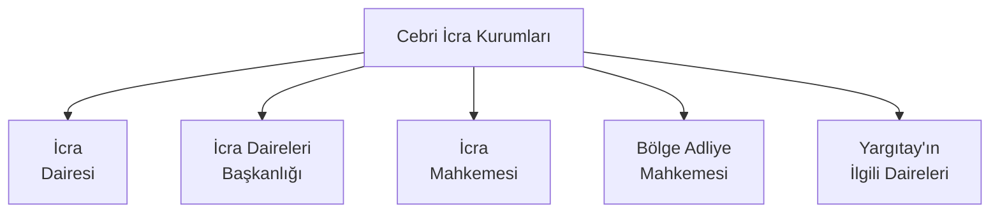

# İcra Hukuku - Genel Hükümler

İlk çağlarda borç ilişkisinden kaynaklı sorunlar şiddet ve tehdit içerikli olaylarla çözülebilirken günümüz modern hukuku bu tür sorunların önüne geçebilmek, toplumda oluşabilecek husumet ve kargaşayı önleyebilmek adına alacak davalarının medeni kurallar dahilinde sonuca bağlanması amacıyla vardır. Örneğin; Roma Hukuku döneminde *manus iniectio* (el koyma) hükümleri gereği borçlu, borcunu ödemezse alacaklı onu zincire vurup köle olarak çalıştırabilirdi. Günümüzde alacak davası yüzünden borçluyu zincire vurup köle olarak çalıştırmak 5237 sayılı Türk Ceza Kanunu (TCK) hükümlerince suç kabul edilmekte, buna rağmen alacaklının alacağını temin edebilmesi için de İcra ve İflas Kanunu'na (İİK) başvurabileceğini belirtmektedir.

## Cebri İcra

Cebri "zor kullanılarak yaptırılan", icra ise "yapma, yerine getirme, yürütme" anlamına gelmektedir.

Borçlunun borcunu vadesinde ödememesi durumunda alacaklının alacağını almak için başvurabileceği tek yol İcra ve İflas Kanunu'ndan belirtilen cebri icra yoludur. Cebri icra ile borçlunun borcunu ödememesi durumunda alacaklı devlet gücüyle (hukuk yoluyla) alacağını zorla tahsil edebilmektedir.

Cebri icra, ya icra ya da iflas yoluyla olabilmektedir. 

İcra

* İlamlı İcra
* İlamsız İcra

İflas

* Takipli İflas
* Takipsiz (Doğrudan) İflas

olmak üzere kendi içinde ayrılmaktadır.

> [!Tip]
> İlamlı ve ilamsız konularına ilerleyen bölümlerde değineceğiz. Şimdilik "Cebri icra" denilince aklımıza "İcra ve İflas Hukuku"nun gelmesi yeterli. Diğer bir ifade ile cebri icra, hem icra hukuku hem de iflas hukuku hükümlerini kapsamaktadır.

## İcra ve İflas Hukukunun Dayanağı

Hukukta kanun, yönetmelik, tüzük gibi kuralların tümü "mevzuat" olarak adlandırılmaktadır. 

İcra ve İflas Hukuku mevzuatı

* [2004 sayılı İcra ve İflas Kanunu](https://www.mevzuat.gov.tr/MevzuatMetin/1.3.2004.pdf)
* [7445 sayılı İcra ve İflas Kanunu ile Bazı Kanunlardas Değişiklik Yapılmasına Dair Kanun](https://www.mevzuat.gov.tr/MevzuatMetin/1.5.7445.pdf)
* [7499 sayılı Ceza Muhakemesi Kanunu İle Bazı Kanunlarda Değişiklik Yapılmasına Dair Kanun](https://www.mevzuat.gov.tr/MevzuatMetin/1.5.7499.pdf)
* [İcra ve İflâs Kanunu Yönetmeliği](https://www.mevzuat.gov.tr/MevzuatMetin/yonetmelik/7.5.8043.pdf)
* [7201 sayılı Tebligat Kanunu](https://www.mevzuat.gov.tr/mevzuatmetin/1.3.7201.pdf)
* [213 sayılı Vergi Usul Kanunu](https://www.mevzuat.gov.tr/mevzuatmetin/1.4.213.pdf)
* Yargıtay Kararları
* Anayasa Mahkemesi Kararları

gibi birçok kanun, yönetmelik ve kararı içermektedir.

## Cebri İcra Kurumları

* İcra Dairesi
* İcra Daireleri Başkanlığı
* İcra Mahkemesi
* Bölge Adliye Mahkemesi
* Yargıtay'ın İlgili Daireleri

temel icra kurumlarıdır. Bunun dışında icra mahkemesi dışında kalan mahkemeler, cumhuriyet savcıları, adalet müfettişleri yardımcı rolündedir.

### İcra Dairesi

Cebri icranın birinci derece görevli kurumudur.

> [!Note]
> İcra ve İflas Kanunu, Madde 1:
> 
> Her asliye mahkemesinin yargı çevresinde yeteri kadar icra dairesi bulunur.
>  
> Her icra dairesinde Adalet Bakanlığı tarafından atanacak bir icra müdürü, yeteri kadar icra müdür yardımcısı, icra katibi ile adli yargı ilk derece mahkemesi adalet komisyonları tarafından görevlendirilecek mübaşir ve hizmetli bulunur. 

İcra dairelerine ilk maddede değinilmesinden de anlaşılacağı üzere tüm icra konularında en önemli görevi icra daireleri yürütmektedir.

### İcra Dairesinin Temel Görevleri

* Ödeme emri düzenleyip borçluya göndermek
* Borçlunun mallarının haczedilmesi
* Haczedilen malın paraya çevrilmesi
* Paraya çevrilen para ile alacaklının alacağının ödenmesi
* Konusu paradan başka şey olan ilamların icra edilmesi

### İcra Dairesinin Yetkileri

* Her makam ile doğrudan yazışabilir ve bilgi isteyebilir.
* Gerekirse zor kullanabilir.
* Yetkisi dışındaki işlemler için başka icra daireleri ile istinabe edebilir.

### İcra Dairelerinin Yükümlülükleri

* Dosya ve Tutanak Düzenlemek
* Alacağı Ödemek ve Alacak Konusu Eşyayı Muhafaza Etmek
* Menfaati Olan İşleri Görememe
* Menfaati Olan Sözleşme Yapamama

#### Dosya ve Tutanak Düzenlemek

> [!Note]
> İcra ve İflas Kanunu, Madde 8:
> 
> İcra ve iflas daireleri yaptıkları muamelelerle kendilerine vakı talep ve beyanlar hakkında bir tutanak yaparlar. Sözlü itirazlar ile talep ve beyanların altları ilgililer ve icra memuru veya yardımcısı veya katibi tarafından imzalanır.
>  
> İcra ve iflas dairelerince verilen kararlar gerekçeli olarak tutanaklara yazılır.
>
> İlgililer bu tutanakları görebilir ve bunların örneğini alabilir.
>
> İcra ve iflas dairelerinin tutanakları, hilafı sabit oluncaya kadar muteberdir.

"kendilerine vakı talep ve beyanlar"dan kasıt icra dairesine alacağı için giden alacaklının yaptığı talep ve beyandır. Bu talep sözlü olabileceği gibi yazılı da olabilir. En nihayetinde alacaklının beyanı esas alınarak tutanak hazırlanır. "hilafı sabit oluncaya kadar muteberdir" ifadesi bu tutanakların aksi ispatlanana kadar geçerli olduğunu belirtmektedir.

> [!Note]
> İcra ve İflas Kanunu, Madde 8/a:
> 
> İcra ve iflas dairelerince yapılacak her türlü icra ve iflas iş ve işlemlerinde Ulusal Yargı Ağı Bilişim Sistemi kullanılır; her türlü veri, bilgi, belge ve karar, Ulusal Yargı Ağı Bilişim Sistemi vasıtasıyla işlenir, kaydedilir ve saklanır.
>
> Usulüne göre güvenli elektronik imza ile oluşturulan elektronik veriler senet hükmündedir. Güvenli elektronik imza, elle atılan imza ile aynı ispat gücünü haizdir. Güvenli 
elektronik imza, kanunlarda güvenli elektronik imza ile yapılamayacağı açıkça belirtilmiş olan işlemler dışında, elle atılan imza yerine kullanılabilir. Güvenli elektronik imzayla oluşturulan belge ve kararlarda, kanunlarda birden fazla nüshanın düzenlenmesi ve mühürleme işlemini öngören hükümler uygulanmaz.
>
> Zorunlu nedenlerden dolayı fiziki olarak düzenlenen belge veya kararlar, yetkili kişilerce güvenli elektronik imzayla imzalanarak Ulusal Yargı Ağı Bilişim Sistemine aktarılır ve gerektiğinde Ulusal Yargı Ağı Bilişim Sistemi vasıtasıyla ilgili birimlere iletilir. Bu şekilde elektronik ortama aktarılarak ilgili birimlere iletilen belge ve kararların asılları, gönderen icra ve iflas dairesinde saklanır, ayrıca fiziki olarak gönderilmez. Ancak, belge veya kararın aslının incelenmesinin zorunlu olduğu hâller saklıdır.
>
> Elektronik ortamdan fiziki örnek çıkartılması gereken hâllerde, icra müdürü veya görevlendirdiği personel tarafından belgenin aslının aynı olduğu belirtilerek, imzalanır ve 
mühürlenir.
>
> Elektronik ortamda yapılan işlemlerde süre gün sonunda biter.
>
> Ek fıkra:
>
> Alacaklı, Ulusal Yargı Ağı Bilişim Sistemi üzerinden bu sisteme entegre bilişim sistemleri vasıtasıyla dosya safahat bilgileri ile borçlunun mal, hak veya alacağını elli kuruş karşılığında sorgulayabilir. Bu miktar her yıl, bir önceki yıla ilişkin olarak 4/1/1961 tarihli ve 213 sayılı Vergi Usul Kanununun mükerrer 298 inci maddesi hükümleri uyarınca tespit ve ilan edilen yeniden değerleme oranında artırılır. Adalet Bakanlığı yeniden değerleme oranında artırılan ücreti beş katına kadar artırmaya ve azaltmaya ayrıca gün ve dosya esaslı olmak üzere belirli sayıdaki sorgulamayı ücretten istisna tutmaya yetkilidir. Genel yönetim kapsamındaki kamu idarelerinden bu ücret alınmayacağı gibi alacaklının bir gün içinde aynı dosya üzerinden beş kez yapacağı sorgudan da ücret alınmaz. Bu kapsamda alınacak ücret Adalet Bakanlığının belirleyeceği usule göre tahsil edilir ve takip gideri olarak borçluya yüklenemez.
>
> Elektronik işlemlerin Ulusal Yargı Ağı Bilişim Sistemi vasıtasıyla yapılmasına dair usul ve esaslar, Adalet Bakanlığı tarafından çıkarılan yönetmelikle düzenlenir.

Her türlü icra ve iflas işlemlerinde 2012 yılındandan itibaren kullanılmaya başlanan Ulusal Yargı Ağı Bilişim Sistemi (UYAP Bilişim Sistemi) icra ve iflas tutanak ve dosyalarının fiziki olarak hazırlansa bile elektronik ortamda saklanmasını zorunlu kılmıştır. 8. maddede zorunlu hallerde ıslak imza kullanılsa bile elektronik imzaların atılacağı ve bu imzaların ıslak imzalar ile aynı hükümde olacağı vurgulanmıştır.

Dosya numaraları takibin yapıldığı yılın numarası ile başlar ve ardından sıra numarası eklenir. Örneğin; 2027/1424. 
2027 takibin yapıldığı yılı, 1424 ise bu yıldaki 1424. takibi belirtmektedir.

> [!Tip]
> Bu noktada "tutanak" ile "dosya" arasındaki farkı belirtmekte fayda var. Tutanak, alacaklı ile icra dairesi arasındaki beyanları içerir. Dosya ise takibin başlaması ile birlikte icra dairesi ile borçlu arasındaki belgeleri içerir. Bu nedenle tutanak da takip dosyasının ayrılmaz bir parçasıdır. 

